# 一.流程图

## 1. **绘图方向**

|   命令   |   方向   |
| :------: | :------: |
| TB（TD） | 从上到下 |
|    BT    | 从下到上 |
|    RL    | 从右到左 |
|    LR    | 从左到右 |

## 2. **节点形状**

|        命令         |        形状        |
| :-----------------: | :----------------: |
|       A[text]       | 文本框（默认形状） |
|       B(text)       |       圆角框       |
|      C([text])      |     体育场型框     |
|      D[(text)]      |     数据库型框     |
|      E((text))      |       圆形框       |
|       F>text]       |      非对称框      |
|       G{text}       |       菱形框       |
|      H{{text}}      |      六边形框      |
| I[/text/] J[\text\] |    平行四边形框    |

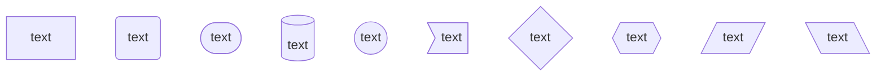


## 3. **连线形状**

|    命令    |     形状     | 添加文本  |
| :--------: | :----------: | :-------: |
| A1 --> B1  |   直线箭头   | --text--> |
| A2 --- B2  |     直线     | --text--- |
| A3 -.-> B3 |   虚线箭头   | -.text.-> |
| A4 -.- B4  |     虚线     | -.text.-- |
| A5 === B5  |   加粗直线   | ==text=== |
| A6 ==> B6  | 加粗直线箭头 | ==text==> |

【注】还有一种简单添加文本的方式：连线后使用 |text| 来在连线上添加文本。


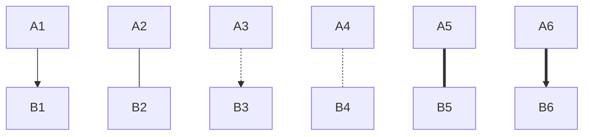


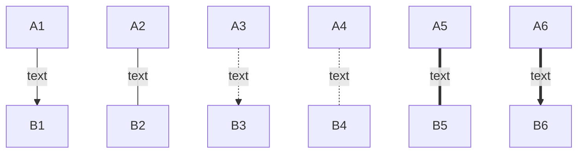


【注】可以使用 **&** 同时指定多个节点之间的多个连线。


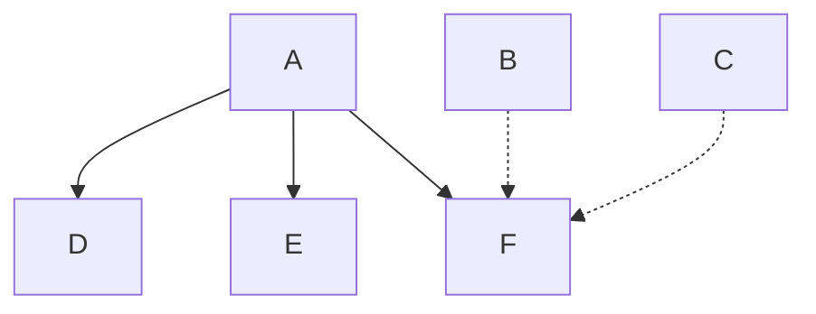


## 4. **子流程图**

代码格式如下：


```markdown
subgraph xxx
    ······
end
```

其中，**xxx** 为该子图的标题。
 【注】不论 graph 还是 subgraph 中的节点标识都是全局的。


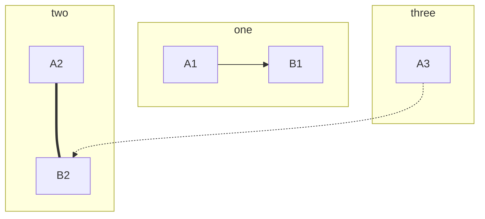


## 5. **注释**

graph流程图中以 **%%** 为开头注释一行。


~~~markdown
    ```mermaid
    graph LR
        A --> B %%此处为注释
    ```
~~~

## 6. **链接**

graph流程图可以在节点标识上绑定 URL ，当点击对应节点时，链接到对应的 URL。语法格式如下


```markdown
click nodeID URL
```

举例如下：点击节点 A 会跳转到百度搜索引擎页面。


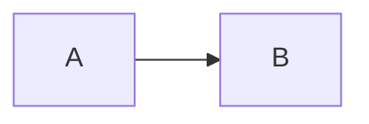


# 二.其他图

## 1.**键盘样式**

```
<kbd>Ctrl</kbd>+<kbd>Alt</kbd>+<kbd>Del</kbd> 
```

 <kbd>Ctrl</kbd>+<kbd>Alt</kbd>+<kbd>Del</kbd> 

## 2.数学公式

```markdown
$$
\begin{Bmatrix}
   a & b \\
   c & d
\end{Bmatrix}
$$
```


$$
\begin{Bmatrix}
   a & b \\
   c & d
\end{Bmatrix}
$$

```markdown
$$
\begin{CD}
   A @>a>> B \\
@VbVV @AAcA \\
   C @= D
\end{CD}
$$
```


$$
\begin{CD}
   A @>a>> B \\
@VbVV @AAcA \\
   C @= D
\end{CD}
$$

## 3.甘特图

```markdown
gantt
        dateFormat  YYYY-MM-DD
        title 软件开发甘特图
        section 设计
        需求                      :done,    des1, 2022-01-06,2022-01-08
        原型                      :active,  des2, 2022-01-09, 3d
        UI设计                     :         des3, after des2, 5d
    未来任务                     :         des4, after des3, 5d
        section 开发
        学习准备理解需求                      :crit, done, 2022-01-06,24h
        设计框架                             :crit, done, after des2, 2d
        开发                                 :crit, active, 3d
        未来任务                              :crit, 5d
        耍                                   :2d
        section 测试
        功能测试                              :active, a1, after des3, 3d
        压力测试                               :after a1  , 20h
        测试报告                               : 48h
```


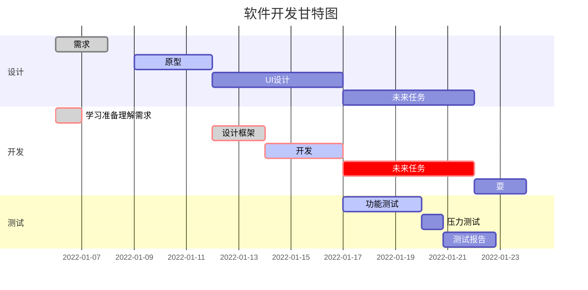

## 4.饼图

```markdown
pie   
title Pets adopted by volunteers
 "Dogs" : 386
 "Cats" : 85
 "Rats" : 15 
```


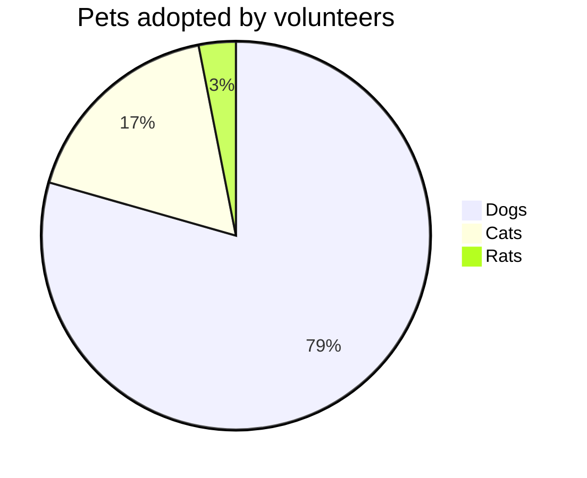

## 5.状态图

```
stateDiagram

[]-->Active
state Active {
[]-->NumLockOff
NumLockOff-->NumLockOn : EvNumLockPressed

NumLockOn-->NumLockOff : EvNumLockPressed
--

[*]-->ScrollLockOff
ScrollLockOff-->ScrollLockOn : EvCapsLockPressed
ScrollLockOn-->ScrollLockOff : EvCapsLockPressed
}
```

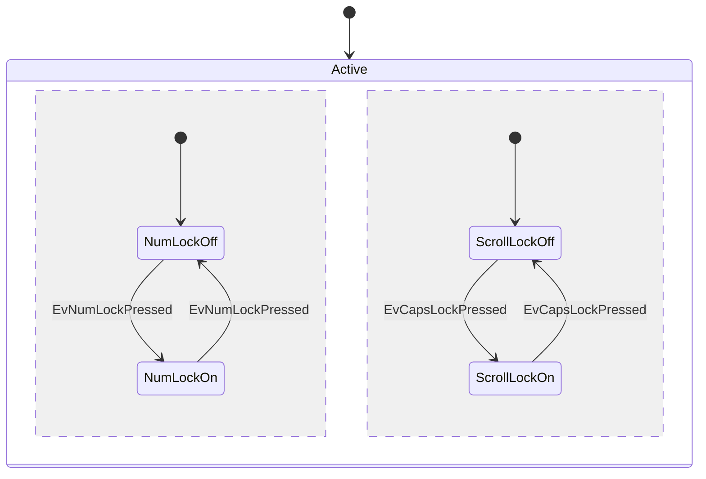

## 6.实体-联系图

```
erDiagram
CUSTOMER ||--o{ORDER : places
ORDER ||--|{LINE-ITEM : contains
CUSTOMER}|..|{DELIVERY-ADDRESS : uses
```


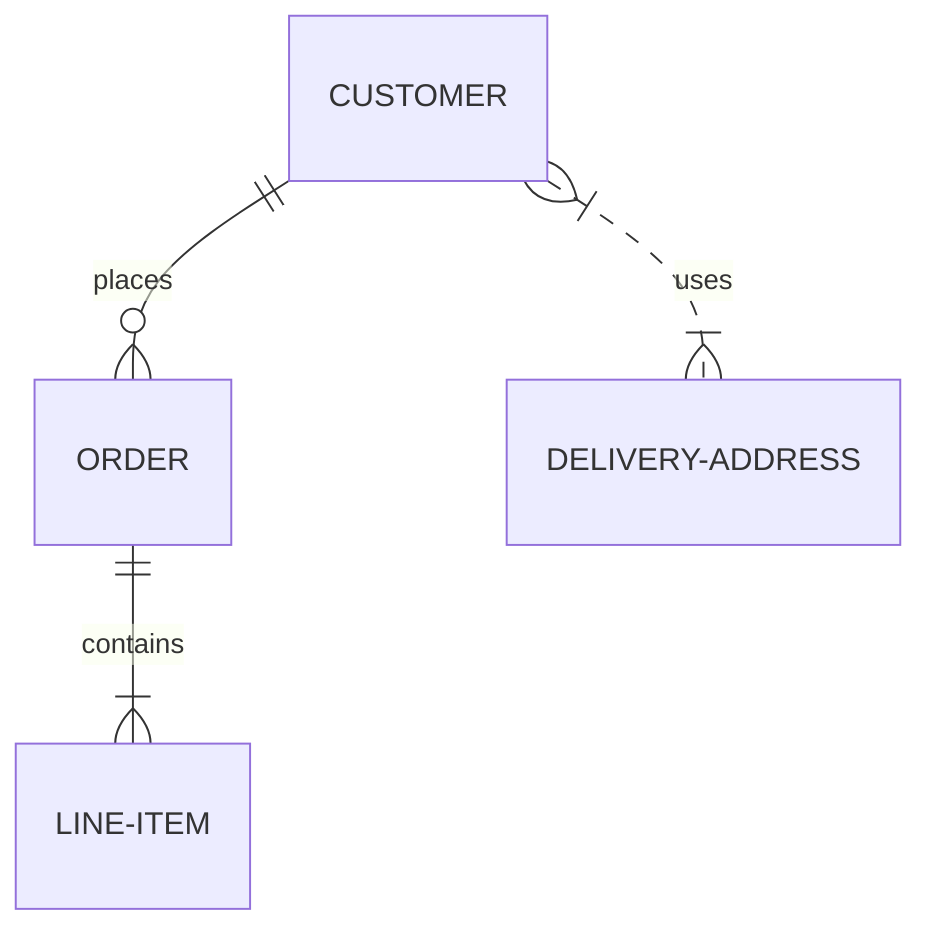

## 7.类图

```markdown
classDiagram

Class01 <|-- AveryLongClass: Cool
<<interface>> Class01
Class09-->C2: Where am i?

Class09 --|> Class07
Class07: equals()
Class07: Object[] elementData
Class01: size()
Class01: int chimp
Class01: int gorilla
class Class10 {
<<service>>
int id
size()
}
```

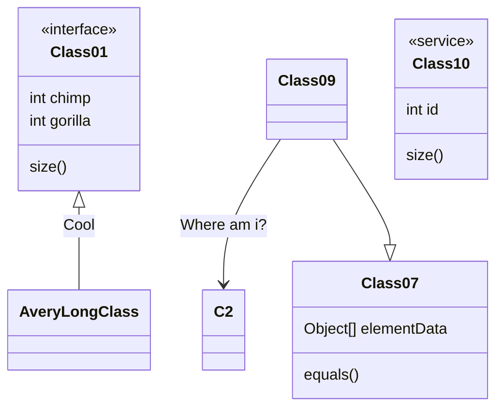

## 8.用户旅程图

> 用户旅程非常详细地描述了不同用户为在系统、应用程序或网站中完成特定任务而采取的步骤。此技术显示当前（按原样）用户工作流，并显示未来工作流的改进领域。（维基百科）

渲染用户旅程图：

```markdown
journey
    title My working day
    section Go to work
      Make tea: 5: Me
      Go upstairs: 3: Me
      Do work: 1: Me, Cat
    section Go home
      Go downstairs: 5: Me
      Sit down: 5: Me
```


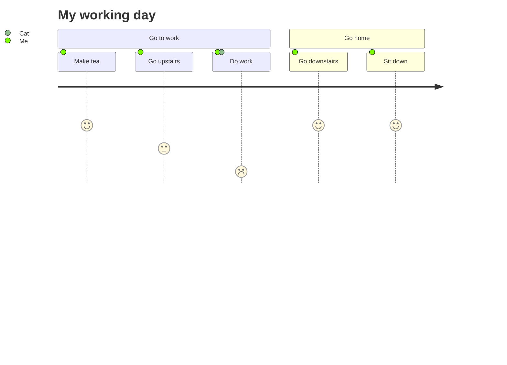

## 9.流程图样式更改

>style id fill:填充颜色,stroke:边框颜色,stroke-width:边框厚度,fill-opacity:透明度

```markdown
graph LR
	a--步骤-->b & c
	style a fill:#f92,stroke:#332,stroke-width:4px,fill-opacity:0.5
%%  style id fill:填充颜色,stroke:边框颜色,stroke-width:边框厚度,fill-opacity:透明度
    style b fill:#ccf,stroke:#f66,stroke-width:2px,stroke-dasharray: 10,5
```


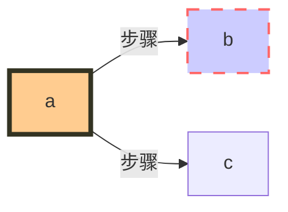


